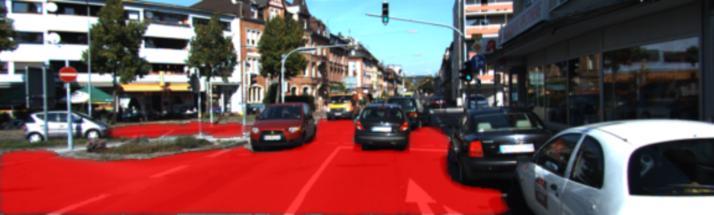
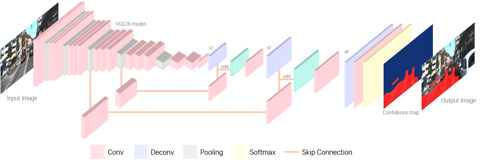
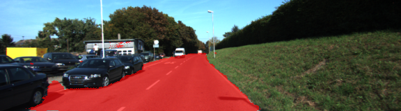
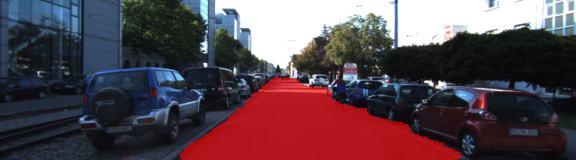
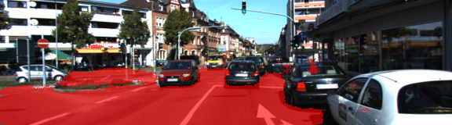
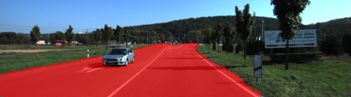
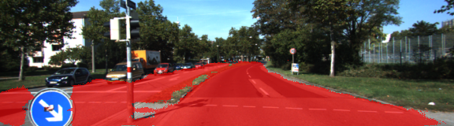

# Semantic Segmentation

<p align="center">
    <br>
    <b>Road Inference result</b><br>
</p>  

### Introduction  
In this project, we'll label the pixels of a road in images using a Fully Convolutional Network (FCN).  

### Setup
##### Frameworks and Packages
Make sure you have the following is installed:
 - [Python 3](https://www.python.org/)
 - [TensorFlow](https://www.tensorflow.org/)
 - [NumPy](http://www.numpy.org/)
 - [SciPy](https://www.scipy.org/)
##### Dataset
Download the [Kitti Road dataset](http://www.cvlibs.net/datasets/kitti/eval_road.php) from [here](http://www.cvlibs.net/download.php?file=data_road.zip).  Extract the dataset in the `data` folder.  This will create the folder `data_road` with all the training a test images.

### Environment  
  
#### software  
  
>Windows 10(x64), tensorflow 1.3.0, Python 3.5, OpenCV 3.1.0  
  
#### hardware  
  
>CPU : i7-7700HQ 2.80GHz, GPU : GTX 1060, Memory : 8GB  

### Run
Run the following command to run the project:
```
python main.py
```
**Note** The main code is set for training mode. If you want to test the training result, change the 'training' to 'testing' mode. Also, for the video-type test dataset, set the 'test_type' to 'video'. You can change these values on main function.  
 
### Model

<p align="center">
    <br>
    <b>Model Structure</b><br>
</p> 

- The model is based on VGG 16 pre-trained network. But, for the FCN(Fully Convolutional Network), we added deconvolutional layer & skip-connection method. For more details about this method, please read [this paper](https://people.eecs.berkeley.edu/~jonlong/long_shelhamer_fcn.pdf).  
- The link for the frozen `VGG16` model is hardcoded into `helper.py`.  The model can be found [here](https://s3-us-west-1.amazonaws.com/udacity-selfdrivingcar/vgg.zip)
- The model is not vanilla `VGG16`, but a fully convolutional version, which already contains the 1x1 convolutions to replace the fully connected layers.  

### Result
<p align="center">
    <br>
    Road Inference Process (batch size 8, 75 epoch)<br>
</p>

<p align="center">
     <br>
	 <br>
	 <br>
    Road Inference Result (batch size 8, 75 epoch)<br>
</p>

The rest of the inference Result image of KITTI test dataset can be found at 'runs' folder.  


